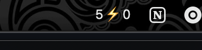

# Claude Pulse

Lightweight macOS menubar app for monitoring Claude Code sessions. Prevents your Mac from sleeping while agents are working.



**Display:** `active⚡waiting` — active sessions (CPU > 3%) and sessions waiting for your input.

## Features

- **Menubar status** — live count of active and waiting sessions
- **Sleep prevention** — automatically keeps your Mac awake while agents are running (IOKit power assertion, released when idle)
- **Sound alert** — ping when a session starts waiting for input
- **Click to focus** — jump to any session's terminal window
- **Emoji picker** — customize the menubar separator icon

## How it works

- **Active**: detected via `ps` CPU usage (Claude streams at 8-30% CPU)
- **Waiting**: detected via Claude Code [hooks](https://docs.anthropic.com/en/docs/claude-code/hooks) — a `Notification` hook writes to `~/.claude/monitor/waiting/`, cleared on `UserPromptSubmit` or `SessionEnd`
- **Sleep prevention**: when active agents exist, an IOKit power assertion prevents idle sleep. Released automatically when no agents are running.

## Install

```bash
git clone https://github.com/Iskrata/claude-pulse.git
cd claude-pulse
bash install.sh
```

Then add hooks to `~/.claude/settings.json`:

```json
{
  "hooks": {
    "Notification": [{"matcher": "", "hooks": [{"type": "command", "command": "bash ~/.claude/monitor/hook.sh notify"}]}],
    "UserPromptSubmit": [{"matcher": "", "hooks": [{"type": "command", "command": "bash ~/.claude/monitor/hook.sh clear"}]}],
    "SessionEnd": [{"matcher": "", "hooks": [{"type": "command", "command": "bash ~/.claude/monitor/hook.sh clear"}]}]
  }
}
```

## Requirements

- macOS
- Swift compiler (ships with Xcode CLI tools)
- Claude Code CLI
